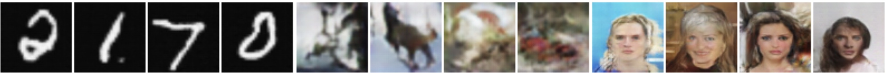
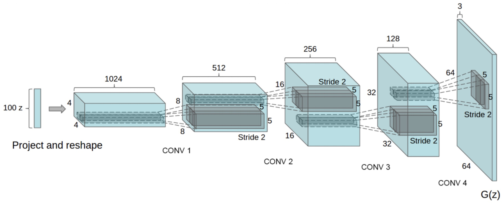
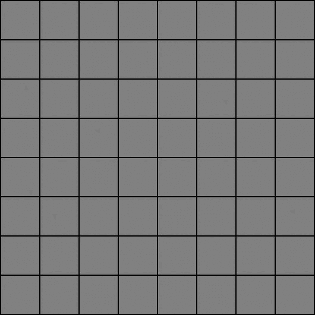
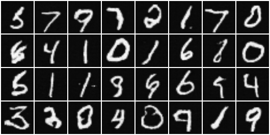
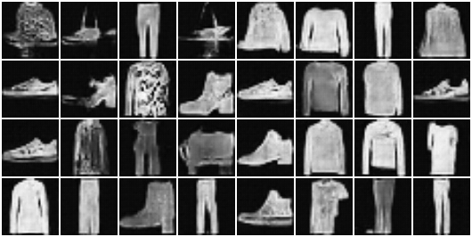
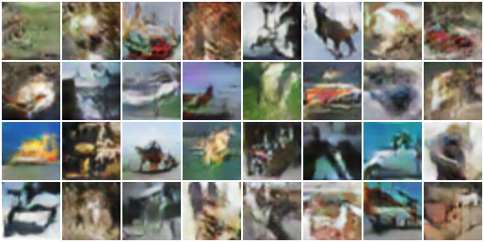
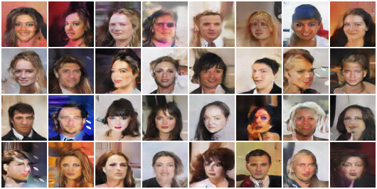

# torch-gan - Convolutional Deep Generative Adversarial Networks (DCGAN)




## About

Author: [Markus Enzweiler](https://markus-enzweiler-de), markus.enzweiler@hs-esslingen.de

Convolutional deep generative adversarial networks (DCGAN) implementation in PyTorch. Supported datasets include MNIST,Fashion-MNIST, CIFAR-10/100 and CelebA. 

See https://github.com/menzHSE/cv-ml-lecture-notebooks for interactive Jupyter notebooks using this package with additional explanations and visualizations. 

## GAN Implementation Overview

The architecture of the implemented DCGANs in this repository follows the influential paper ["Unsupervised Representation Learning with Deep Convolutional Generative Adversarial Networks"](https://arxiv.org/abs/1511.06434):



<br>

<sup>(Figure taken from https://arxiv.org/abs/1511.06434)</sup>
<br>
<br>
Particularly, we follow the best practices and parameter settings mentioned in the paper:


- **Fully Convolutional Architecture:** Adapts a convolutional approach throughout the model for both the generator and discriminator, enhancing feature extraction capabilities.
- **Architecture Guidelines for Stability:** Incorporates best practices for stable training of deep convolutional GANs, such as:
  - Replacing pooling layers with strided convolutions in the discriminator and transposed convolutions in the generator.
  - Utilizing batch normalization in both the generator and discriminator to improve training dynamics.
  - Omitting fully connected hidden layers in deeper architectures to streamline the network.
  - Employing ReLU activation in the generator for all layers except the output, which uses a Tanh function.
  - Integrating LeakyReLU activation in the discriminator for all layers, enhancing gradient flow.
  - Custom weight initialization and Adam optimizer with adapted parameters, as given in the DCGAN paper.  

For another guide on creating a DCGAN with PyTorch, including additional insights and practical tips, also check out the [PyTorch DCGAN tutorial](https://pytorch.org/tutorials/beginner/dcgan_faces_tutorial.html).


## Requirements
* torch
* torchvision
* torchinfo
* numpy
* Pillow

See [requirements.txt](requirements.txt). 

```pip install -r requirements.txt```

## Data

Supported datasets include MNIST, CIFAR-10/100 and CelebA which are automatically downloaded using torchvision. In case of CelebA, there is a [known issue](https://github.com/pytorch/vision/issues/1920) with limited quota on the Google drive where CelebA is hosted. 

If you are getting a download error due to exceeded quota, please download CelebA manually from https://graal.ift.ulaval.ca/public/celeba/ and place all downloaded files in the ```data/celeba``` directory. No need to unzip anything. 

## Usage

### Model Training

Pretrained models for all datasets are available in the ```pretrained``` directory. The models carry information of the maximum number of filters in the conv layers (```--max_filters```) and the number of latent dimensions (```--latent_dims```) in their filename. These models use a maximum of 512 channels in the (transposed) convolution layers and 100 latent dimensions as input to the Generator (taken from the DCGAN paper). To train a GAN model consisting of discriminator and generator use ```python train.py```. 

```
$ python train.py -h
usage: Train a convolutional GAN with PyTorch. [-h] [--cpu] [--seed SEED]
                                               [--batchsize BATCHSIZE]
                                               [--max_filters MAX_FILTERS]
                                               [--epochs EPOCHS] [--lr LR]
                                               [--dataset {mnist,cifar-10,cifar-100,celeb-a}]
                                               [--latent_dims LATENT_DIMS]

optional arguments:
  -h, --help            show this help message and exit
  --cpu                 Use CPU instead of GPU (cuda/mps) acceleration
  --seed SEED           Random seed
  --batchsize BATCHSIZE
                        Batch size for training
  --max_filters MAX_FILTERS
                        Maximum number of filters in the convolutional layers
  --epochs EPOCHS       Number of training epochs
  --lr LR               Learning rate
  --dataset {mnist,fashion-mnist,cifar-10,cifar-100,celeb-a}
                        Select the dataset to use (mnist, fashion-mnist, cifar-10,
                        cifar-100, celeb-a)
  --latent_dims LATENT_DIMS
                        Number of latent dimensions (positive integer)
```
**Example**
The status output during training shows the losses for the discriminator and the generator , the averaged output values of the discriminator for real images, $D(x)$, and for fake images, $D(G(z))$, both before and after an optimization step. 

- **Discriminator Loss**: Measures the discriminator's ability to distinguish between real and generated images. Lower values indicate higher accuracy.
- **Generator Loss**: Reflects the generator's effectiveness in creating images that the discriminator mistakes as real. A lower value signifies better performance.
- **$D(x)$**: The average score given by the discriminator to real images. Ideally, this should be very high at the beginning of training, indicating accurate recognition of real images. However, it should not remain at a very high level, as this would suggest that the generator is not providing a sufficient challenge.
- **$D(G(z))$**: The average score for generated (fake) images. Initially, this may be low, but an increase over time is desirable. This indicates that the generator is improving and creating more realistic images that are increasingly able to fool the discriminator.


Balancing these values is key in GAN training. The overall process is very sensitive to different model architectures, hyperparameters, etc. The goal is for the generator to progressively get better at creating realistic images, while the discriminator maintains a robust ability to tell real from fake.

```
$ python train.py --dataset=mnist
Using device: cuda
NVIDIA H100 PCIe
Options:
  Device: GPU
  Seed: 0
  Batch size: 128
  Max number of filters: 512
  Number of epochs: 30
  Learning rate: 0.0002
  Dataset: mnist
  Number of latent dimensions: 100
==========================================================================================
Layer (type (var_name))                  Output Shape              Param #
==========================================================================================
Generator (Generator)                    [1, 1, 64, 64]            --
├─ConvTranspose2d (conv1)                [1, 512, 4, 4]            819,200
├─BatchNorm2d (bn1)                      [1, 512, 4, 4]            1,024
├─ConvTranspose2d (conv2)                [1, 256, 8, 8]            1,179,648
├─BatchNorm2d (bn2)                      [1, 256, 8, 8]            512
├─ConvTranspose2d (conv3)                [1, 128, 16, 16]          294,912
├─BatchNorm2d (bn3)                      [1, 128, 16, 16]          256
├─ConvTranspose2d (conv4)                [1, 64, 32, 32]           73,728
├─BatchNorm2d (bn4)                      [1, 64, 32, 32]           128
├─ConvTranspose2d (conv5)                [1, 1, 64, 64]            576
==========================================================================================
Total params: 2,369,984
Trainable params: 2,369,984
Non-trainable params: 0
Total mult-adds (Units.MEGABYTES): 241.96
==========================================================================================
Input size (MB): 0.00
Forward/backward pass size (MB): 2.00
Params size (MB): 9.48
Estimated Total Size (MB): 11.48
==========================================================================================

==========================================================================================
Layer (type (var_name))                  Output Shape              Param #
==========================================================================================
Discriminator (Discriminator)            [1, 1]                    --
├─Conv2d (conv1)                         [1, 64, 32, 32]           576
├─BatchNorm2d (bn1)                      [1, 64, 32, 32]           128
├─Conv2d (conv2)                         [1, 128, 16, 16]          73,728
├─BatchNorm2d (bn2)                      [1, 128, 16, 16]          256
├─Conv2d (conv3)                         [1, 256, 8, 8]            294,912
├─BatchNorm2d (bn3)                      [1, 256, 8, 8]            512
├─Conv2d (conv4)                         [1, 512, 4, 4]            1,179,648
├─BatchNorm2d (bn4)                      [1, 512, 4, 4]            1,024
├─Conv2d (conv5)                         [1, 1, 1, 1]              8,192
==========================================================================================
Total params: 1,558,976
Trainable params: 1,558,976
Non-trainable params: 0
Total mult-adds (Units.MEGABYTES): 57.22
==========================================================================================
Input size (MB): 0.02
Forward/backward pass size (MB): 1.97
Params size (MB): 6.24
Estimated Total Size (MB): 8.22
==========================================================================================

Ep    0: L_D  0.281 | L_G  2.112 | D(X)  0.929 | D(G(z))  0.126 /  0.120 | TP   13934 im/s |  Time   20.793 (s)
Ep    1: L_D  0.432 | L_G  1.743 | D(X)  0.787 | D(G(z))  0.271 /  0.209 | TP   14094 im/s |  Time    8.121 (s)
Ep    2: L_D  0.566 | L_G  1.153 | D(X)  0.641 | D(G(z))  0.411 /  0.349 | TP   13998 im/s |  Time    8.182 (s)
...
...
...
Ep   27: L_D  0.346 | L_G  2.044 | D(X)  0.867 | D(G(z))  0.185 /  0.159 | TP   14173 im/s |  Time    8.829 (s)
Ep   28: L_D  0.345 | L_G  2.042 | D(X)  0.870 | D(G(z))  0.182 /  0.161 | TP   14164 im/s |  Time    8.770 (s)
Ep   29: L_D  0.325 | L_G  2.118 | D(X)  0.890 | D(G(z))  0.163 /  0.144 | TP   14132 im/s |  Time    8.775 (s)
```

### Progress of the Generator during Training 

#### MNIST



#### MNIST


#### CIFAR-10


#### CelebA


### Generating Samples from the Generator

The generator in a DCGAN is pivotal for creating new images. It begins with a random latent vector, typically following a normal distribution, as its input. This vector, representing a random point in latent space, is what the generator uses to produce an image.

When generating an image, the generator's role is to map this latent vector to an image that mirrors the distribution of real images it's been trained on. This process involves the transformation of the input vector's distribution into something that resembles the data distribution of real images, that is however not explicity estimated. It is just sampled from with the help of the generator.  

#### Steps for Image Generation
- Latent vector creation: Start with a random latent vector sampled from a normal distribution. The size of this vector is defined by the GAN's architecture.

- Transformation the by generator: Feed the latent vector into the generator network. The generator then uses its learned parameters to transform this vector into an image.

- Output: The result is a synthetic image that, ideally, looks similar to the images the network was trained on.


Use ```python generate.py``` to generate random samples. 


``` 
$ python generate.py -h
usage: Generate samples from a GAN Generator with PyTorch. [-h] [--cpu] [--seed SEED] --model MODEL --latent_dims
                                                           LATENT_DIMS --max_filters MAX_FILTERS [--nsamples NSAMPLES]
                                                           --outdir OUTDIR [--nimg_channels NIMG_CHANNELS]

optional arguments:
  -h, --help            show this help message and exit
  --cpu                 Use CPU instead of GPU (cuda/mps) acceleration
  --seed SEED           Random seed
  --model MODEL         Model filename *.pth
  --latent_dims LATENT_DIMS
                        Number of latent dimensions (positive integer)
  --max_filters MAX_FILTERS
                        Maximum number of filters in the convolutional layers
  --nsamples NSAMPLES   Number of samples to generate
  --outdir OUTDIR       Output directory for the generated samples
  --nimg_channels NIMG_CHANNELS
                        Number of image channels (1 for grayscale, 3 for RGB)
```

#### Examples

**Sample from the generator model trained on MNIST**

```python generate.py  --model=pretrained/mnist/G_filters_0512_dims_0100.pth --latent_dims=100 --max_filters=512 --nimg_channels=1 --outdir=samples/mnist --nsamples=32``` 



**Sample from the generator model trained on Fashion-MNIST**

```python generate.py  --model=pretrained/fashion-mnist/G_filters_0512_dims_0100.pth --latent_dims=100 --max_filters=512 --nimg_channels=1 --outdir=samples/fashion-mnist --nsamples=32``` 



**Sample from the generator model trained on CIFAR-10**

```python generate.py  --model=pretrained/cifar-10/G_filters_0512_dims_0100.pth --latent_dims=100 --max_filters=512 --nimg_channels=3 --outdir=samples/cifar-10  --nsamples=32```



**Sample from the generator model trained on CelebA**

```python generate.py  --model=pretrained/celeb-a/G_filters_0512_dims_0100.pth --latent_dims=100 --max_filters=512 --nimg_channels=3 --outdir=samples/celeb-a --nsamples=32```




